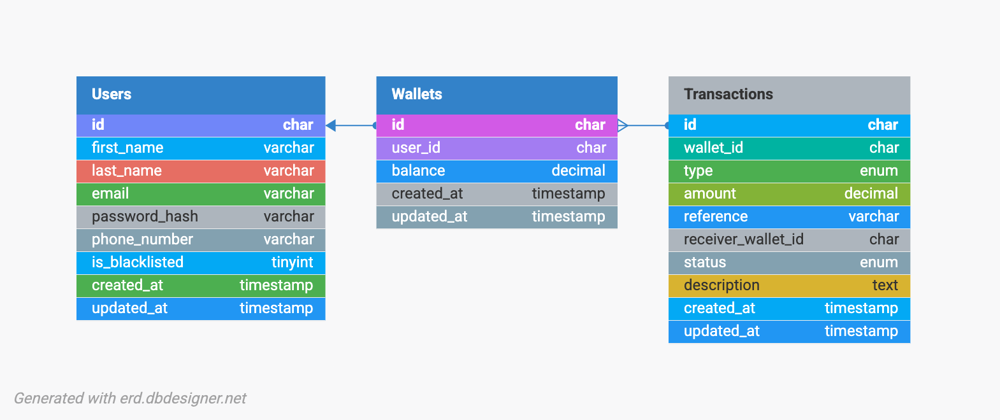

# Demo Credit Wallet Service

## Overview

Demo Credit Wallet Service is a wallet management API that enables users to create accounts, fund wallets, transfer funds, and withdraw funds securely.

## Deployment

For Render native Node deployments, compile the TypeScript sources during the build step and start the compiled server entrypoint.

- Build Command: `yarn install --frozen-lockfile && yarn build`
- Start Command: `yarn start`

Do not start the service with `node dist/app.js`. That file only exports the Express application. The HTTP server boots from `dist/server.js`.

The service integrates with the Adjutor Karma Blacklist API to prevent onboarding users who have been blacklisted. It is built using Node.js, TypeScript, MySQL, and Knex, following a layered architecture that promotes maintainability, scalability, and testability.

### Features

- User registration
- Karma blacklist validation via Adjutor
- Wallet creation upon successful onboarding
- Wallet funding
- Wallet-to-wallet transfers
- Wallet withdrawals
- JWT-based authentication
- Unit and integration tests
- Swagger API documentation

---

## Architecture

The application follows a layered architecture:

```text
Controllers
    ↓
Services
    ↓
Models
    ↓
Database
```

### Architectural Decisions

- **Controllers** handle HTTP requests and responses.
- **Services** contain business logic.
- **Models** abstract database operations.
- **Database Layer** manages persistence using Knex and MySQL.

This separation of concerns improves maintainability, testability, and code readability.

---

## Technology Stack

| Technology | Purpose                     |
| ---------- | --------------------------- |
| Node.js    | Runtime Environment         |
| TypeScript | Static Typing               |
| Express    | Web Framework               |
| MySQL      | Relational Database         |
| Knex       | Query Builder & Migrations  |
| JWT        | Authentication              |
| Jest       | Unit Testing                |
| Supertest  | API Testing                 |
| Swagger    | API Documentation           |
| Docker     | Containerization (Optional) |

---

## Entity Relationship Diagram



### Relationships

- A User owns one Wallet.
- A Wallet belongs to one User.
- A Wallet can have many Transactions.
- A Transfer references both a sender and receiver Wallet.
- An Idempotency Key is associated with a User and a specific request.

---

## Database Design

### Users

Stores customer onboarding information.

| Column     | Description          |
| ---------- | -------------------- |
| id         | Primary Key          |
| first_name | User first name      |
| last_name  | User last name       |
| email      | Unique email address |
| phone      | Phone number         |
| created_at | Creation timestamp   |

### Wallets

Stores wallet balances.

| Column  | Description            |
| ------- | ---------------------- |
| id      | Primary Key            |
| user_id | Owner                  |
| balance | Current wallet balance |

### Transactions

Maintains an immutable audit trail.

| Column    | Description                     |
| --------- | ------------------------------- |
| id        | Primary Key                     |
| wallet_id | Related wallet                  |
| type      | FUNDING / TRANSFER / WITHDRAWAL |
| amount    | Transaction amount              |
| reference | Unique reference                |
| status    | Transaction status              |

### Transfers

Stores transfer-specific records.

| Column             | Description               |
| ------------------ | ------------------------- |
| sender_wallet_id   | Sender wallet             |
| receiver_wallet_id | Receiver wallet           |
| amount             | Transfer amount           |
| reference          | Unique transfer reference |

### Idempotency Keys

Prevents duplicate processing of financial operations.

| Column   | Description             |
| -------- | ----------------------- |
| key      | Unique idempotency key  |
| user_id  | Request owner           |
| response | Cached response payload |

---

## Authentication

A simplified JWT-based authentication mechanism was implemented as permitted by the assessment requirements.

Upon successful registration, the API issues a JWT token which must be supplied in subsequent requests.

### Example

```http
Authorization: Bearer <token>
```

Protected endpoints require a valid token.

---

## Karma Blacklist Validation

During onboarding, the service validates the user's BVN against the Adjutor Karma Blacklist API.

### Registration Flow

```text
Register User
      ↓
Check Karma Blacklist
      ↓
Blacklisted?
  ↙       ↘
Yes        No
 ↓          ↓
Reject   Create User
             ↓
        Create Wallet
```

Users found on the blacklist are not onboarded and no wallet is created.

---

## Transaction Handling

Wallet operations are executed within database transactions to ensure atomicity and consistency.

### Operations Executed Within Transactions

- Wallet funding
- Wallet withdrawal
- Wallet transfers

### Benefits

- Prevents partial updates
- Guarantees consistency
- Ensures atomic operations

Example:

```text
Debit Sender
Credit Receiver
Create Transaction Records
Commit
```

If any step fails, the transaction is rolled back.

---

## Concurrency Control

To prevent race conditions and double spending, row-level locking is used during debit operations.

Example:

```sql
SELECT * FROM wallets
WHERE id = ?
FOR UPDATE
```

This ensures concurrent requests cannot modify the same wallet balance simultaneously.

---

## Idempotency Strategy

Financial operations support idempotency keys.

This prevents duplicate processing when clients retry requests due to network failures or timeouts.

### Example Request

```json
{
  "amount": 1000,
  "idempotencyKey": "8f7e17d2-7c42-4c2a-8e9b-4d6b7b4f6f42"
}
```

### Flow

```text
Receive Request
      ↓
Check Idempotency Key
      ↓
Already Exists?
   ↙        ↘
 Yes         No
  ↓           ↓
Return      Process
Stored      Request
Response      ↓
           Save Result
```

---

## API Documentation

Swagger documentation is available at:

```text
http://localhost:3000/docs
```

Production:

```text
https://<candidate-name>-lendsqr-be-test.<cloud-domain>/docs
```

---

## API Endpoints

| Method | Endpoint         | Description             |
| ------ | ---------------- | ----------------------- |
| POST   | /auth/register   | Register a user         |
| POST   | /auth/login      | Login user              |
| GET    | /wallet/balance  | Retrieve wallet balance |
| POST   | /wallet/fund     | Fund wallet             |
| POST   | /wallet/transfer | Transfer funds          |
| POST   | /wallet/withdraw | Withdraw funds          |

---

## Project Setup

### Clone Repository

```bash
git clone <repository-url>

cd demo-credit-wallet-service
```

### Install Dependencies

```bash
npm install
```

### Environment Variables

Create a `.env` file:

```env
PORT=3000

DB_HOST=localhost
DB_PORT=3306
DB_NAME=wallet_service

DB_USER=root
DB_PASSWORD=password

JWT_SECRET=super-secret

ADJUTOR_API_KEY=your-api-key
```

### Run Migrations

```bash
npm run migrate
```

### Run Application

```bash
npm run dev
```

---

## Running Tests

Run all tests:

```bash
npm test
```

Generate coverage report:

```bash
npm run test:coverage
```

### Test Coverage Includes

- User registration
- Karma blacklist validation
- Wallet funding
- Wallet withdrawal
- Wallet transfer
- Authentication middleware
- Error handling

Positive and negative scenarios are covered.

---

## Assumptions

- Each user owns exactly one wallet.
- Wallet balances cannot become negative.
- Users can only transfer funds to existing users.
- Amounts are stored using the smallest currency unit.
- Idempotency keys are unique per user request.
- Transfers are processed synchronously.

---

## Future Improvements

- Refresh token authentication
- Redis-backed idempotency storage
- Transaction reversal workflows
- Event-driven transaction processing
- Multi-wallet support
- Webhook notifications
- Fraud detection and monitoring
- Rate limiting and abuse protection

---

## Deployment

### API

```text
https://<candidate-name>-lendsqr-be-test.<cloud-domain>
```

### Swagger Documentation

```text
https://<candidate-name>-lendsqr-be-test.<cloud-domain>/docs
```

---

## Repository

```text
https://github.com/<username>/<repository-name>
```

---

## Design Decisions Summary

- Layered architecture for maintainability and testability.
- Knex migrations for schema management.
- MySQL as the relational datastore.
- JWT-based faux authentication as required by the assessment.
- Database transactions for all wallet operations.
- Row-level locking to prevent race conditions.
- Idempotency support for financial operations.
- Adjutor integration to enforce blacklist validation.
- Comprehensive unit and integration tests.
